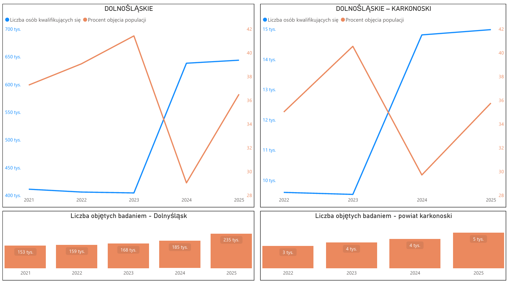

# Data Analytics Portfolio Projects
I started working with data when one of my projects at work required me to collect all the files with reports and data 
created so far in the company into a coherent and transparent database. At first, I worked with what was available, 
i.e., I tried to organize Excel files so that they used formulas and macros, and pivot tables became the standard 
for extracting specific data. In the meantime, I became interested in SQL and trained myself to create a real database 
so that I could implement the system in the company and connect it to the forms I had created in MS Access. This sparked 
my interest in data analysis, and wanting to develop further in this direction, I decided to create this portfolio 
in which I will share my work.

## Projects

- [Project 1: Covid](https://github.com/ArturCHO/Portfolio/blob/main/COVID.sql)
  
  The dataset contains records of Covid-19 cases, deaths and vaccine records by country in 2020-2021. 
  This project includes the following steps: data loading, data cleaning and preprocessing and EDA (exploratory data analysis).

  Skills: Joins, CTE's, Temp Tables, Windows Functions, Aggregate Functions, Creating Views, Converting Data Types

  [Tableau Dashboard](https://public.tableau.com/app/profile/artur.chowa.ski/viz/CovidDashboard_17623568897080/Dashboard1)

- [Project 2: Restaurant](https://github.com/ArturCHO/Portfolio/blob/main/Restaurant%20SQL.sql)

  The dataset contains one week of restaurant transaction data, including order details, items, categories, prices, and tips.
  The project performs exploratory data analysis (EDA) to uncover customer behavior and revenue patterns.

  Key steps include:
  - Calculating average order value and daily average spending
  - Identifying the most frequently ordered dishes
  - Analyzing peak order hours
  - Computing average tip percentage per day
  - Determining the most profitable items and categories
  - Extracting Top 3 best-selling dishes per day using window functions

 - [Project 3: Analysis of mammography research in Poland]

   - Percentage of population covered by surveys over time and population size trend [(LINK)](https://github.com/ArturCHO/Portfolio/blob/main/Mammography%201.pdf)
   
   - Incidence of cervical cancer in recent years [(Link)](https://github.com/ArturCHO/Portfolio/blob/main/Mammography%202.pdf)
   
     Cleaning and modeling data with DAX, PowerBi Dashboards

   
